# GoMultiDB — Architecture Diagrams

## 1. C4 Context: System Overview

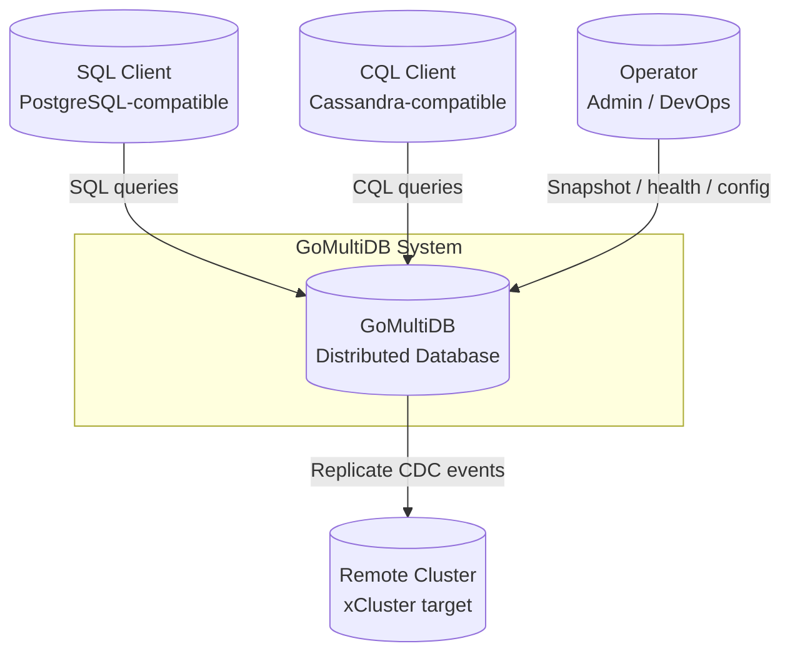
```mermaid
flowchart TB
    subgraph boundary[GoMultiDB System]
        SYS[("GoMultiDB\nDistributed Database")]
    end

    SQL_CLIENT[("SQL Client\nPostgreSQL-compatible")]
    CQL_CLIENT[("CQL Client\nCassandra-compatible")]
    OPS[("Operator\nAdmin / DevOps")]
    REMOTE_CLUSTER[("Remote Cluster\nxCluster target")]

    SQL_CLIENT -->|"SQL queries"| SYS
    CQL_CLIENT -->|"CQL queries"| SYS
    OPS -->|"Snapshot / health / config"| SYS
    SYS -->|"Replicate CDC events"| REMOTE_CLUSTER
```

---

## 2. C4 Container: Deployable Units

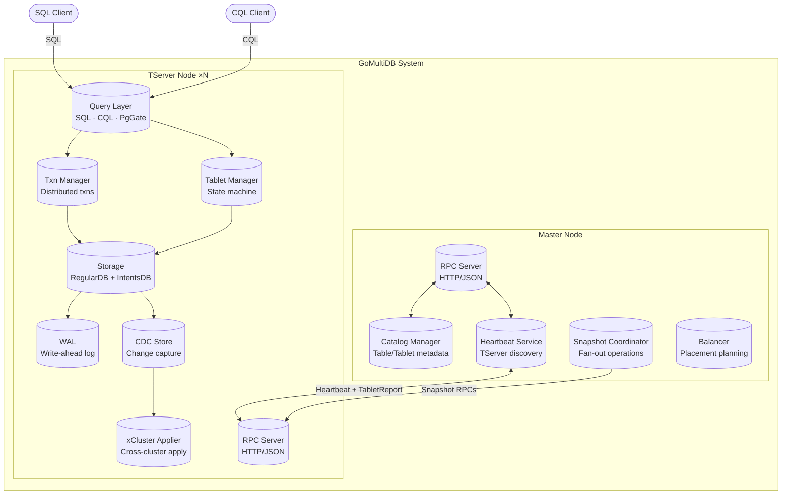
```mermaid
flowchart TB
    subgraph system[GoMultiDB System]
        direction TB

        subgraph master_box[Master Node]
            CATALOG[("Catalog Manager\nTable/Tablet metadata")]
            HB[("Heartbeat Service\nTServer discovery")]
            SNAP_COORD[("Snapshot Coordinator\nFan-out operations")]
            BALANCER[("Balancer\nPlacement planning")]
            MASTER_RPC[("RPC Server\nHTTP/JSON")]
        end

        subgraph tserver_box[TServer Node ×N]
            QUERY[("Query Layer\nSQL · CQL · PgGate")]
            TABLET_MGR[("Tablet Manager\nState machine")]
            STORAGE[("Storage\nRegularDB + IntentsDB")]
            WAL[("WAL\nWrite-ahead log")]
            TXN[("Txn Manager\nDistributed txns")]
            CDC[("CDC Store\nChange capture")]
            XCLUSTER[("xCluster Applier\nCross-cluster apply")]
            TS_RPC[("RPC Server\nHTTP/JSON")]
        end
    end

    SQL_CLIENT(["SQL Client"])
    CQL_CLIENT(["CQL Client"])

    SQL_CLIENT -->|"SQL"| QUERY
    CQL_CLIENT -->|"CQL"| QUERY
    QUERY --> TXN
    QUERY --> TABLET_MGR
    TXN --> STORAGE
    TABLET_MGR --> STORAGE
    STORAGE --> WAL
    STORAGE --> CDC
    CDC --> XCLUSTER

    HB <-->|"Heartbeat + TabletReport"| TS_RPC
    SNAP_COORD -->|"Snapshot RPCs"| TS_RPC
    MASTER_RPC <--> CATALOG
    MASTER_RPC <--> HB
```

---

## 3. C4 Component: TServer Internals

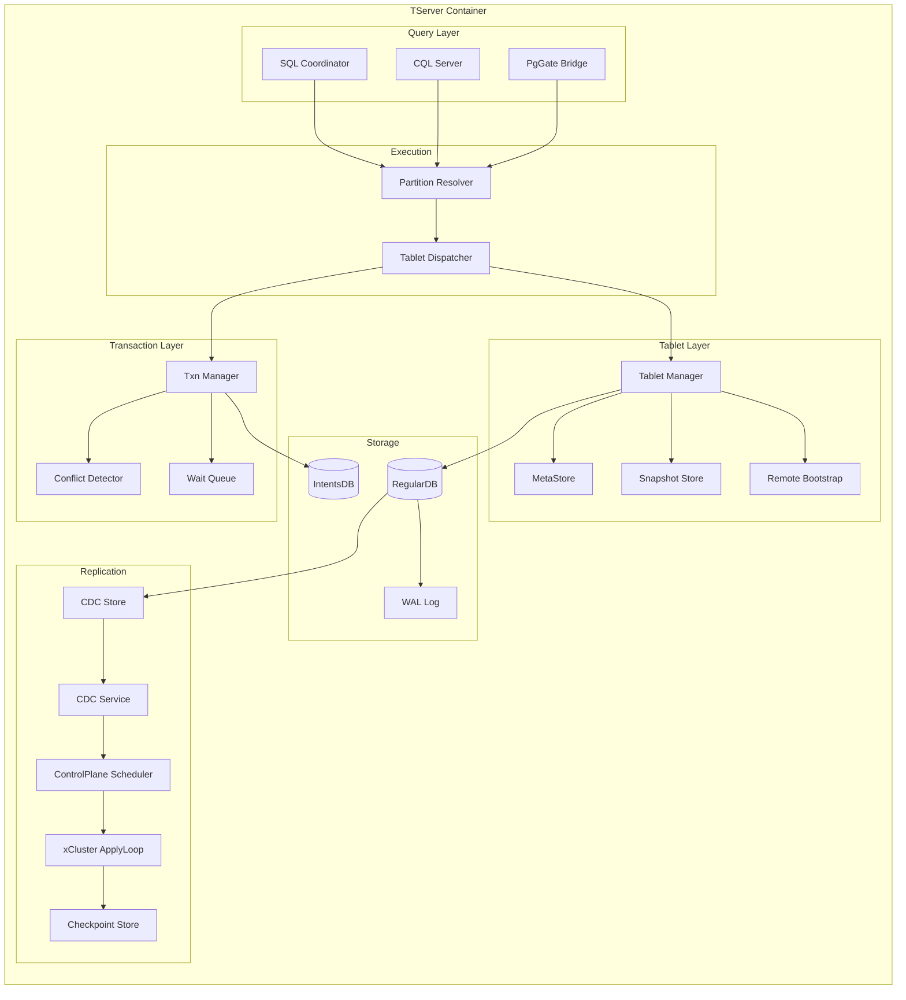
```mermaid
flowchart TB
    subgraph tserver[TServer Container]
        direction TB

        subgraph query_layer[Query Layer]
            SQL_COORD[SQL Coordinator]
            CQL_SRV[CQL Server]
            PGGATE[PgGate Bridge]
        end

        subgraph exec[Execution]
            PART_RESOLVER[Partition Resolver]
            TABLET_DISP[Tablet Dispatcher]
        end

        subgraph txn_layer[Transaction Layer]
            TXN_MGR[Txn Manager]
            CONFLICT[Conflict Detector]
            WAIT_Q[Wait Queue]
        end

        subgraph tablet_layer[Tablet Layer]
            TAB_MGR[Tablet Manager]
            META_STORE[MetaStore]
            SNAP_STORE[Snapshot Store]
            REMOTE_BOOT[Remote Bootstrap]
        end

        subgraph storage_layer[Storage]
            REGULAR_DB[(RegularDB)]
            INTENTS_DB[(IntentsDB)]
            WAL_LOG[WAL Log]
        end

        subgraph replication[Replication]
            CDC_STORE[CDC Store]
            CDC_SVC[CDC Service]
            CP_SCHED[ControlPlane Scheduler]
            XCLU_APPLY[xCluster ApplyLoop]
            CHECKPOINT[Checkpoint Store]
        end
    end

    SQL_COORD --> PART_RESOLVER
    CQL_SRV --> PART_RESOLVER
    PGGATE --> PART_RESOLVER
    PART_RESOLVER --> TABLET_DISP
    TABLET_DISP --> TXN_MGR
    TXN_MGR --> CONFLICT
    TXN_MGR --> WAIT_Q
    TXN_MGR --> INTENTS_DB
    TABLET_DISP --> TAB_MGR
    TAB_MGR --> META_STORE
    TAB_MGR --> SNAP_STORE
    TAB_MGR --> REMOTE_BOOT
    TAB_MGR --> REGULAR_DB
    REGULAR_DB --> WAL_LOG
    REGULAR_DB --> CDC_STORE
    CDC_STORE --> CDC_SVC
    CDC_SVC --> CP_SCHED
    CP_SCHED --> XCLU_APPLY
    XCLU_APPLY --> CHECKPOINT
```

---

## 4. Sequence: Client Write → Replication

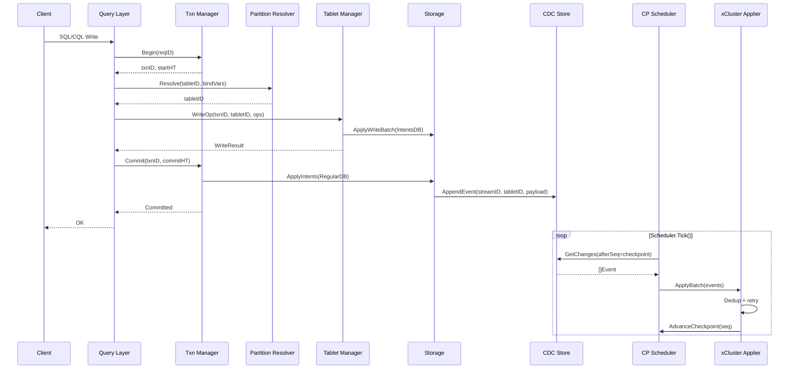
```mermaid
sequenceDiagram
    participant C as Client
    participant Q as Query Layer
    participant TM as Txn Manager
    participant PR as Partition Resolver
    participant T as Tablet Manager
    participant ST as Storage
    participant CDC as CDC Store
    participant SCH as CP Scheduler
    participant XC as xCluster Applier

    C->>Q: SQL/CQL Write
    Q->>TM: Begin(reqID)
    TM-->>Q: txnID, startHT
    Q->>PR: Resolve(tableID, bindVars)
    PR-->>Q: tabletID
    Q->>T: WriteOp(txnID, tabletID, ops)
    T->>ST: ApplyWriteBatch(IntentsDB)
    T-->>Q: WriteResult
    Q->>TM: Commit(txnID, commitHT)
    TM->>ST: ApplyIntents(RegularDB)
    ST->>CDC: AppendEvent(streamID, tabletID, payload)
    TM-->>Q: Committed
    Q-->>C: OK

    loop Scheduler.Tick()
        SCH->>CDC: GetChanges(afterSeq=checkpoint)
        CDC-->>SCH: []Event
        SCH->>XC: ApplyBatch(events)
        XC->>XC: Dedup + retry
        XC->>SCH: AdvanceCheckpoint(seq)
    end
```

---

## 5. Sequence: Heartbeat & Tablet Discovery

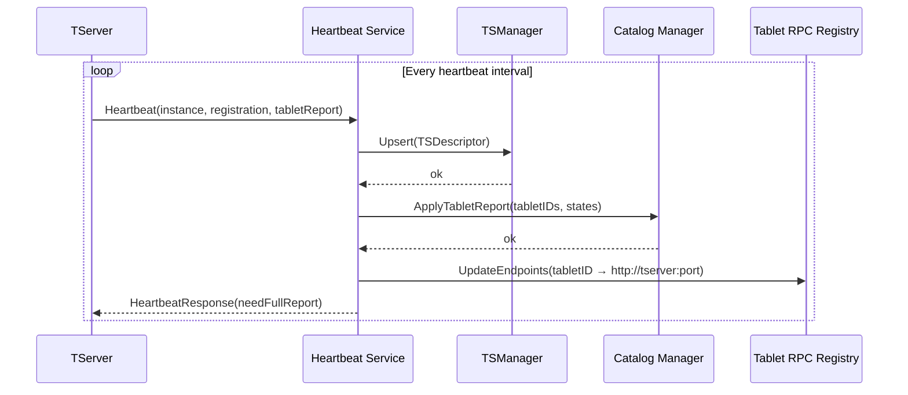
```mermaid
sequenceDiagram
    participant TS as TServer
    participant HB as Heartbeat Service
    participant TSM as TSManager
    participant CAT as Catalog Manager
    participant REG as Tablet RPC Registry

    loop Every heartbeat interval
        TS->>HB: Heartbeat(instance, registration, tabletReport)
        HB->>TSM: Upsert(TSDescriptor)
        TSM-->>HB: ok
        HB->>CAT: ApplyTabletReport(tabletIDs, states)
        CAT-->>HB: ok
        HB->>REG: UpdateEndpoints(tabletID → http://tserver:port)
        HB-->>TS: HeartbeatResponse(needFullReport)
    end
```

---

## 6. Sequence: Distributed Snapshot

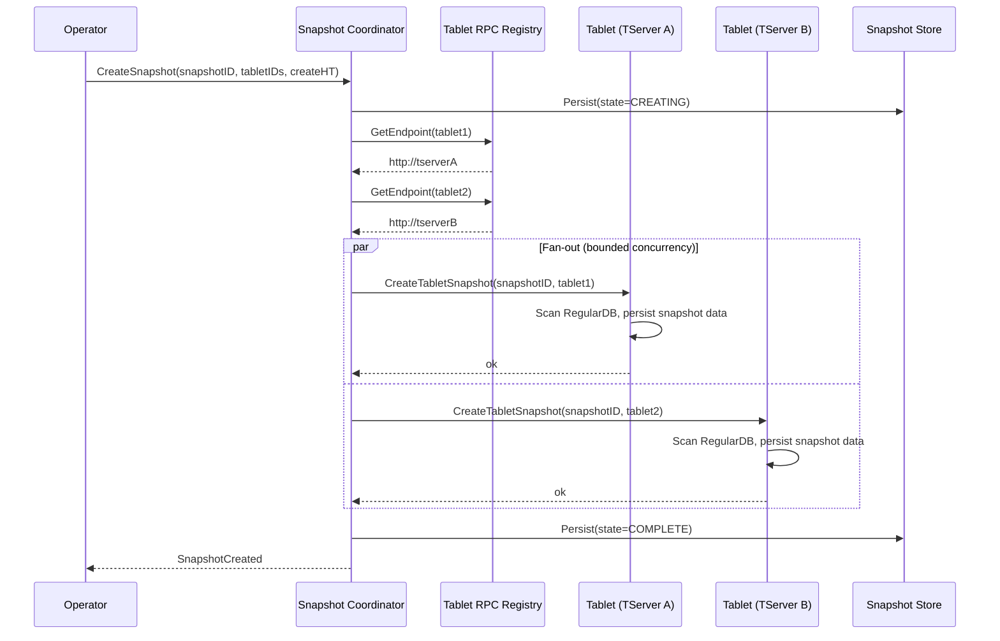
```mermaid
sequenceDiagram
    participant OPS as Operator
    participant SC as Snapshot Coordinator
    participant REG as Tablet RPC Registry
    participant T1 as Tablet (TServer A)
    participant T2 as Tablet (TServer B)
    participant SS as Snapshot Store

    OPS->>SC: CreateSnapshot(snapshotID, tabletIDs, createHT)
    SC->>SS: Persist(state=CREATING)
    SC->>REG: GetEndpoint(tablet1)
    REG-->>SC: http://tserverA
    SC->>REG: GetEndpoint(tablet2)
    REG-->>SC: http://tserverB

    par Fan-out (bounded concurrency)
        SC->>T1: CreateTabletSnapshot(snapshotID, tablet1)
        T1->>T1: Scan RegularDB, persist snapshot data
        T1-->>SC: ok
    and
        SC->>T2: CreateTabletSnapshot(snapshotID, tablet2)
        T2->>T2: Scan RegularDB, persist snapshot data
        T2-->>SC: ok
    end

    SC->>SS: Persist(state=COMPLETE)
    SC-->>OPS: SnapshotCreated
```

---

## 7. State: Tablet Lifecycle

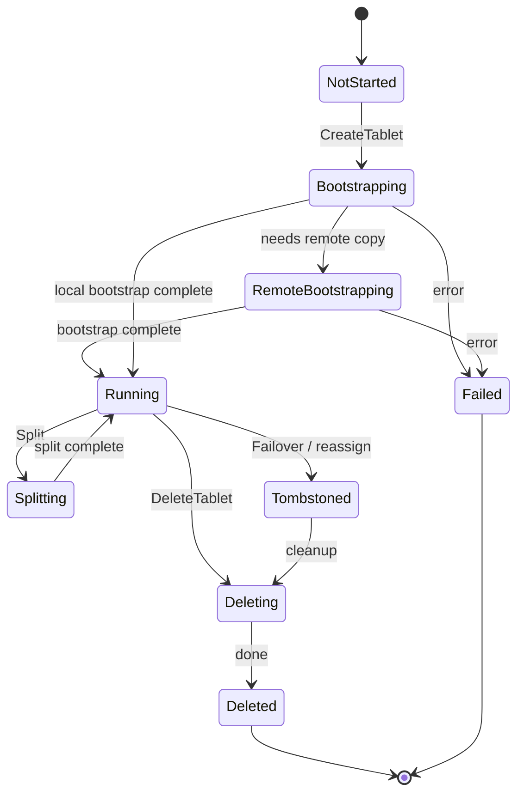
```mermaid
stateDiagram-v2
    [*] --> NotStarted
    NotStarted --> Bootstrapping : CreateTablet
    Bootstrapping --> RemoteBootstrapping : needs remote copy
    RemoteBootstrapping --> Running : bootstrap complete
    Bootstrapping --> Running : local bootstrap complete
    Running --> Splitting : Split
    Splitting --> Running : split complete
    Running --> Tombstoned : Failover / reassign
    Running --> Deleting : DeleteTablet
    Tombstoned --> Deleting : cleanup
    Deleting --> Deleted : done
    Bootstrapping --> Failed : error
    RemoteBootstrapping --> Failed : error
    Deleted --> [*]
    Failed --> [*]
```

---

## 8. State: Distributed Transaction Lifecycle

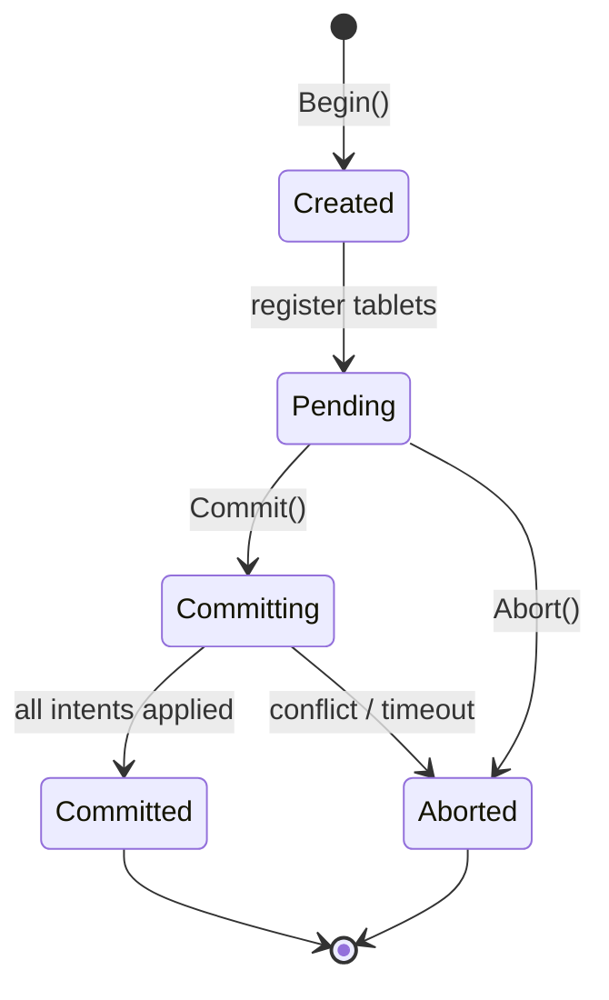
```mermaid
stateDiagram-v2
    [*] --> Created : Begin()
    Created --> Pending : register tablets
    Pending --> Committing : Commit()
    Committing --> Committed : all intents applied
    Pending --> Aborted : Abort()
    Committing --> Aborted : conflict / timeout
    Committed --> [*]
    Aborted --> [*]
```

---

## 9. State: Snapshot Lifecycle

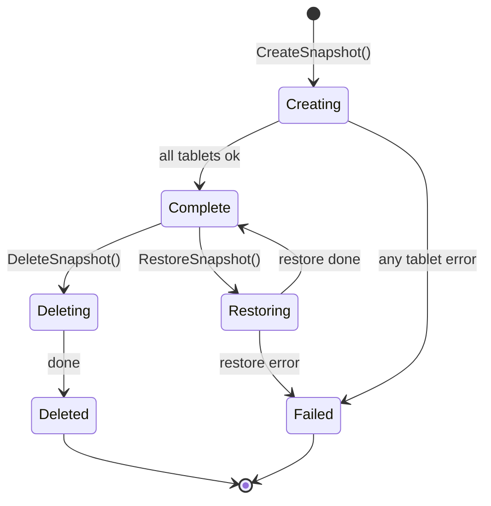
```mermaid
stateDiagram-v2
    [*] --> Creating : CreateSnapshot()
    Creating --> Complete : all tablets ok
    Creating --> Failed : any tablet error
    Complete --> Deleting : DeleteSnapshot()
    Complete --> Restoring : RestoreSnapshot()
    Restoring --> Complete : restore done
    Restoring --> Failed : restore error
    Deleting --> Deleted : done
    Deleted --> [*]
    Failed --> [*]
```

---

## 10. Flowchart: Query Routing Pipeline

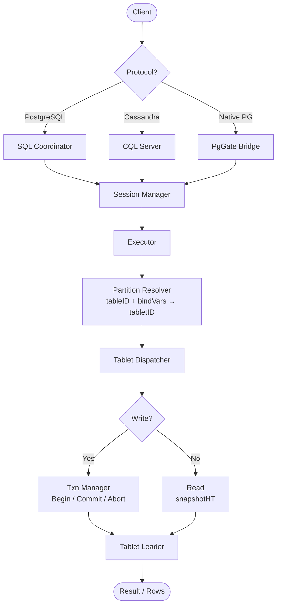
```mermaid
flowchart TD
    CLIENT([Client]) --> PROTO{Protocol?}
    PROTO -->|PostgreSQL| SQL[SQL Coordinator]
    PROTO -->|Cassandra| CQL[CQL Server]
    PROTO -->|Native PG| PGGATE[PgGate Bridge]

    SQL --> SESSION[Session Manager]
    CQL --> SESSION
    PGGATE --> SESSION

    SESSION --> EXEC[Executor]
    EXEC --> PART[Partition Resolver\ntableID + bindVars → tabletID]
    PART --> DISP[Tablet Dispatcher]

    DISP --> WRITE{Write?}
    WRITE -->|Yes| TXN[Txn Manager\nBegin / Commit / Abort]
    WRITE -->|No| READ[Read\nsnapshotHT]

    TXN --> TABLET[Tablet Leader]
    READ --> TABLET

    TABLET --> RESULT([Result / Rows])
```

---

## 11. Flowchart: xCluster Replication Apply Loop

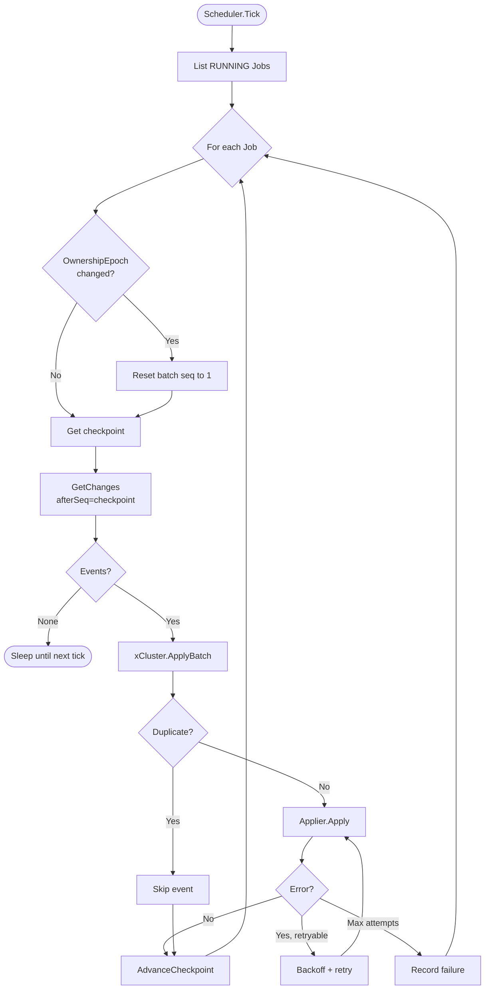
```mermaid
flowchart TD
    START([Scheduler.Tick]) --> LIST[List RUNNING Jobs]
    LIST --> JOB{For each Job}
    JOB --> EPOCH{OwnershipEpoch\nchanged?}
    EPOCH -->|Yes| RESET[Reset batch seq to 1]
    EPOCH -->|No| CKPT[Get checkpoint]
    RESET --> CKPT
    CKPT --> POLL[GetChanges\nafterSeq=checkpoint]
    POLL --> EMPTY{Events?}
    EMPTY -->|None| DONE([Sleep until next tick])
    EMPTY -->|Yes| APPLY[xCluster.ApplyBatch]
    APPLY --> DEDUP{Duplicate?}
    DEDUP -->|Yes| SKIP[Skip event]
    DEDUP -->|No| EXEC_APPLY[Applier.Apply]
    EXEC_APPLY --> RETRY{Error?}
    RETRY -->|Yes, retryable| BACKOFF[Backoff + retry]
    BACKOFF --> EXEC_APPLY
    RETRY -->|Max attempts| FAIL[Record failure]
    RETRY -->|No| ADVANCE[AdvanceCheckpoint]
    SKIP --> ADVANCE
    ADVANCE --> JOB
    FAIL --> JOB
```

---

## 12. C4 Component: Master Node Internals

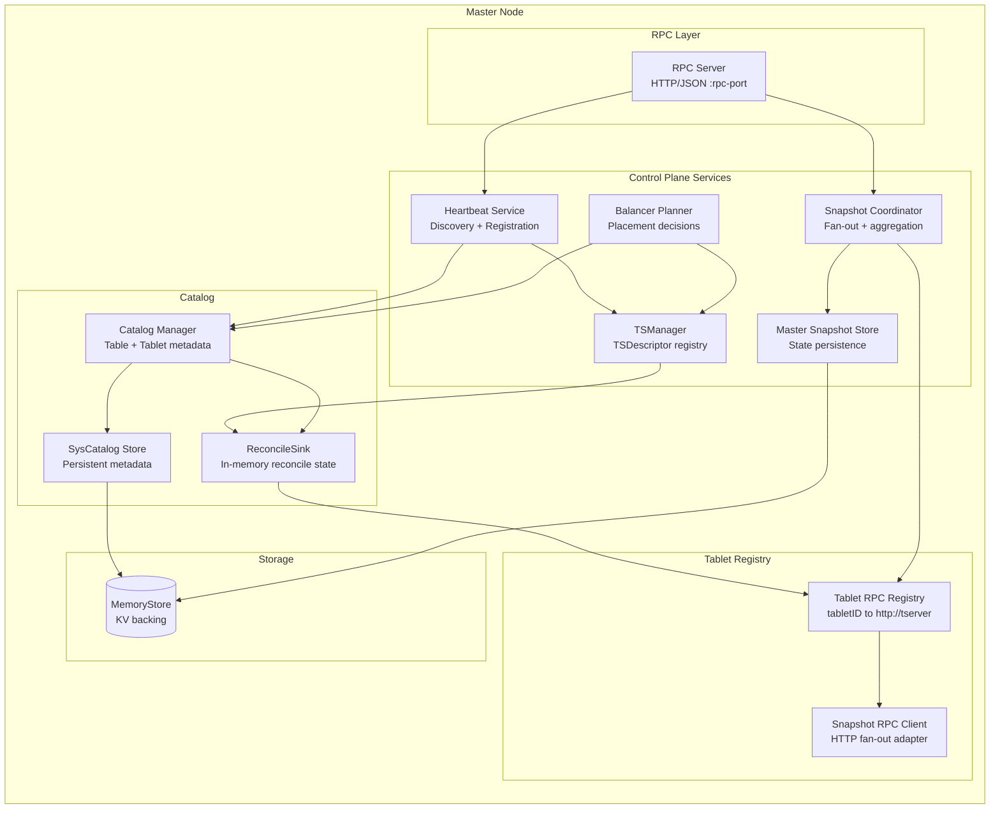
```mermaid
flowchart TB
    subgraph master[Master Node]
        direction TB

        subgraph rpc_layer[RPC Layer]
            RPC_SRV[RPC Server\nHTTP/JSON :rpc-port]
        end

        subgraph control[Control Plane Services]
            HB_SVC[Heartbeat Service\nDiscovery + Registration]
            HB_MGR[TSManager\nTSDescriptor registry]
            SNAP_COORD[Snapshot Coordinator\nFan-out + aggregation]
            SNAP_STORE[Master Snapshot Store\nState persistence]
            BALANCER[Balancer Planner\nPlacement decisions]
        end

        subgraph catalog[Catalog]
            CAT_MGR[Catalog Manager\nTable + Tablet metadata]
            SYSCAT[SysCatalog Store\nPersistent metadata]
            RECON[ReconcileSink\nIn-memory reconcile state]
        end

        subgraph registry[Tablet Registry]
            TAB_REG[Tablet RPC Registry\ntabletID to http://tserver]
            SNAP_CLIENT[Snapshot RPC Client\nHTTP fan-out adapter]
        end

        subgraph storage[Storage]
            ROCKS[(MemoryStore\nKV backing)]
        end
    end

    RPC_SRV --> HB_SVC
    RPC_SRV --> SNAP_COORD
    HB_SVC --> HB_MGR
    HB_SVC --> CAT_MGR
    HB_MGR --> RECON
    CAT_MGR --> SYSCAT
    CAT_MGR --> RECON
    SYSCAT --> ROCKS
    RECON --> TAB_REG
    TAB_REG --> SNAP_CLIENT
    SNAP_COORD --> SNAP_STORE
    SNAP_COORD --> TAB_REG
    SNAP_STORE --> ROCKS
    BALANCER --> CAT_MGR
    BALANCER --> HB_MGR
```

---

## 13. Sequence: Remote Bootstrap (Tablet Recovery)

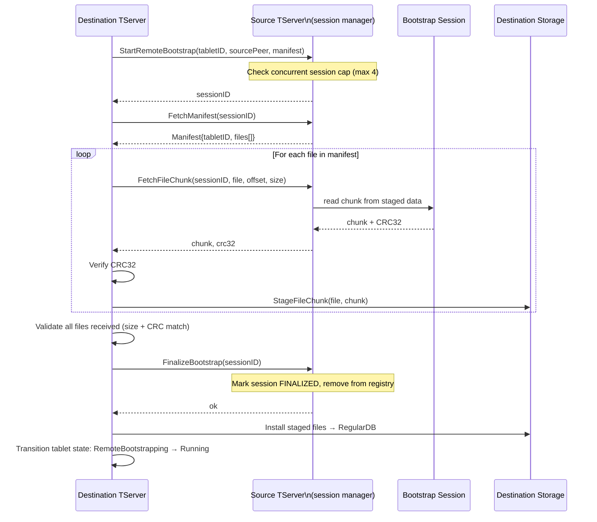
```mermaid
sequenceDiagram
    participant DT as Destination TServer
    participant SRC as Source TServer\n(session manager)
    participant BS as Bootstrap Session
    participant ST as Destination Storage

    DT->>SRC: StartRemoteBootstrap(tabletID, sourcePeer, manifest)
    Note over SRC: Check concurrent session cap (max 4)
    SRC-->>DT: sessionID

    DT->>SRC: FetchManifest(sessionID)
    SRC-->>DT: Manifest{tabletID, files[]}

    loop For each file in manifest
        DT->>SRC: FetchFileChunk(sessionID, file, offset, size)
        SRC->>BS: read chunk from staged data
        BS-->>SRC: chunk + CRC32
        SRC-->>DT: chunk, crc32
        DT->>DT: Verify CRC32
        DT->>ST: StageFileChunk(file, chunk)
    end

    DT->>DT: Validate all files received (size + CRC match)
    DT->>SRC: FinalizeBootstrap(sessionID)
    Note over SRC: Mark session FINALIZED, remove from registry
    SRC-->>DT: ok

    DT->>ST: Install staged files → RegularDB
    DT->>DT: Transition tablet state: RemoteBootstrapping → Running
```

---

## 14. Sequence: Conflict Detection & Resolution

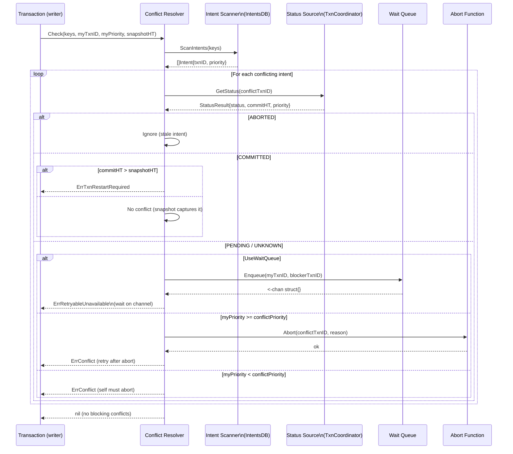
```mermaid
sequenceDiagram
    participant TXN as Transaction (writer)
    participant CR as Conflict Resolver
    participant IS as Intent Scanner\n(IntentsDB)
    participant SS as Status Source\n(TxnCoordinator)
    participant WQ as Wait Queue
    participant AF as Abort Function

    TXN->>CR: Check(keys, myTxnID, myPriority, snapshotHT)
    CR->>IS: ScanIntents(keys)
    IS-->>CR: []Intent{txnID, priority}

    loop For each conflicting intent
        CR->>SS: GetStatus(conflictTxnID)
        SS-->>CR: StatusResult{status, commitHT, priority}

        alt ABORTED
            CR->>CR: Ignore (stale intent)
        else COMMITTED
            alt commitHT > snapshotHT
                CR-->>TXN: ErrTxnRestartRequired
            else
                CR->>CR: No conflict (snapshot captures it)
            end
        else PENDING / UNKNOWN
            alt UseWaitQueue
                CR->>WQ: Enqueue(myTxnID, blockerTxnID)
                WQ-->>CR: <-chan struct{}
                CR-->>TXN: ErrRetryableUnavailable\n(wait on channel)
            else myPriority >= conflictPriority
                CR->>AF: Abort(conflictTxnID, reason)
                AF-->>CR: ok
                CR-->>TXN: ErrConflict (retry after abort)
            else myPriority < conflictPriority
                CR-->>TXN: ErrConflict (self must abort)
            end
        end
    end

    CR-->>TXN: nil (no blocking conflicts)
```

---

## 15. Sequence: Deadlock Detection (Wait Queue DFS)

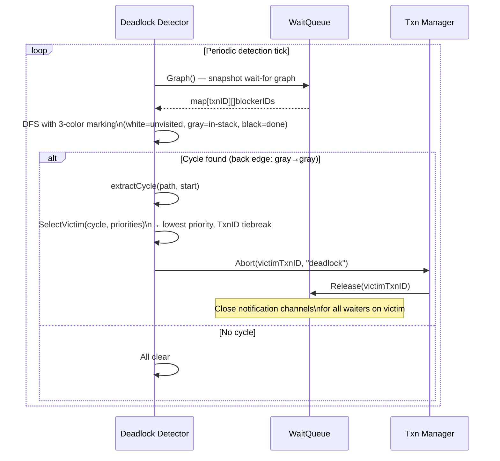
```mermaid
sequenceDiagram
    participant DET as Deadlock Detector
    participant WQ as WaitQueue
    participant TM as Txn Manager

    loop Periodic detection tick
        DET->>WQ: Graph() — snapshot wait-for graph
        WQ-->>DET: map[txnID][]blockerIDs

        DET->>DET: DFS with 3-color marking\n(white=unvisited, gray=in-stack, black=done)

        alt Cycle found (back edge: gray→gray)
            DET->>DET: extractCycle(path, start)
            DET->>DET: SelectVictim(cycle, priorities)\n→ lowest priority, TxnID tiebreak
            DET->>TM: Abort(victimTxnID, "deadlock")
            TM->>WQ: Release(victimTxnID)
            Note over WQ: Close notification channels\nfor all waiters on victim
        else No cycle
            DET->>DET: All clear
        end
    end
```

---

## 16. Sequence: WAL Append Pipeline

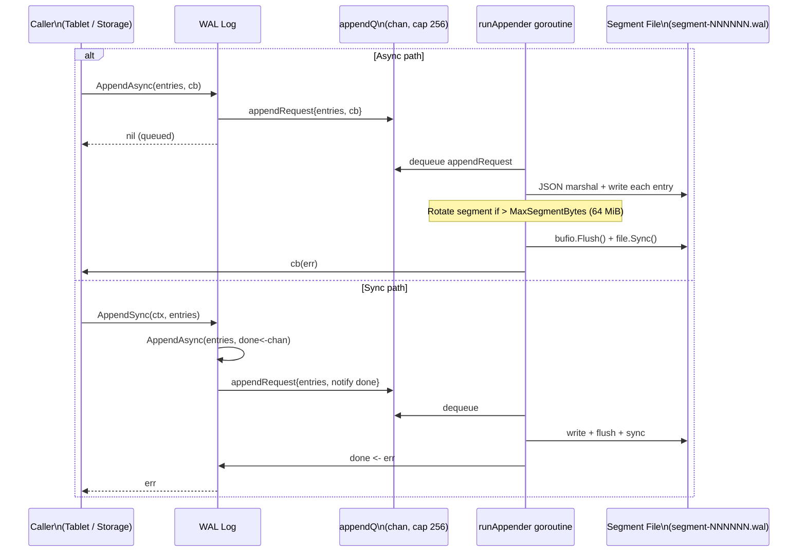
```mermaid
sequenceDiagram
    participant CALLER as Caller\n(Tablet / Storage)
    participant WAL as WAL Log
    participant Q as appendQ\n(chan, cap 256)
    participant APPENDER as runAppender goroutine
    participant SEG as Segment File\n(segment-NNNNNN.wal)

    alt Async path
        CALLER->>WAL: AppendAsync(entries, cb)
        WAL->>Q: appendRequest{entries, cb}
        WAL-->>CALLER: nil (queued)
        APPENDER->>Q: dequeue appendRequest
        APPENDER->>SEG: JSON marshal + write each entry
        Note over APPENDER: Rotate segment if > MaxSegmentBytes (64 MiB)
        APPENDER->>SEG: bufio.Flush() + file.Sync()
        APPENDER->>CALLER: cb(err)
    else Sync path
        CALLER->>WAL: AppendSync(ctx, entries)
        WAL->>WAL: AppendAsync(entries, done<-chan)
        WAL->>Q: appendRequest{entries, notify done}
        APPENDER->>Q: dequeue
        APPENDER->>SEG: write + flush + sync
        APPENDER->>WAL: done <- err
        WAL-->>CALLER: err
    end
```

---

## 17. Flowchart: Balancer Round (3-Priority Planning)

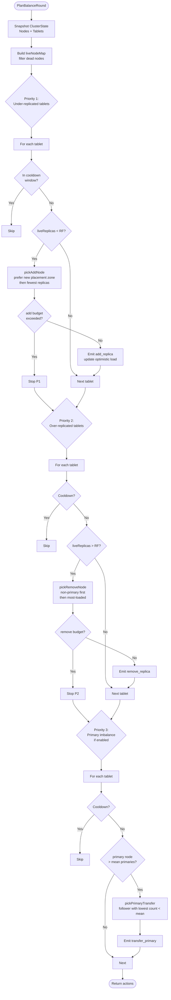
```mermaid
flowchart TD
    START([PlanBalanceRound]) --> SNAPSHOT[Snapshot ClusterState\nNodes + Tablets]
    SNAPSHOT --> LIVE[Build liveNodeMap\nfilter dead nodes]

    LIVE --> P1{Priority 1:\nUnder-replicated tablets}
    P1 --> FOREACH1[For each tablet]
    FOREACH1 --> COOL1{In cooldown\nwindow?}
    COOL1 -->|Yes| SKIP1[Skip]
    COOL1 -->|No| HAVERF{liveReplicas < RF?}
    HAVERF -->|No| NEXT1[Next tablet]
    HAVERF -->|Yes| PICK_ADD[pickAddNode\nprefer new placement zone\nthen fewest replicas]
    PICK_ADD --> BUDGET1{add budget\nexceeded?}
    BUDGET1 -->|Yes| STOP1[Stop P1]
    BUDGET1 -->|No| EMIT_ADD[Emit add_replica\nupdate optimistic load]
    EMIT_ADD --> NEXT1

    STOP1 --> P2{Priority 2:\nOver-replicated tablets}
    NEXT1 --> P2
    P2 --> FOREACH2[For each tablet]
    FOREACH2 --> COOL2{Cooldown?}
    COOL2 -->|Yes| SKIP2[Skip]
    COOL2 -->|No| OVERRF{liveReplicas > RF?}
    OVERRF -->|No| NEXT2[Next tablet]
    OVERRF -->|Yes| PICK_REM[pickRemoveNode\nnon-primary first\nthen most-loaded]
    PICK_REM --> BUDGET2{remove budget?}
    BUDGET2 -->|Yes| STOP2[Stop P2]
    BUDGET2 -->|No| EMIT_REM[Emit remove_replica]
    EMIT_REM --> NEXT2

    STOP2 --> P3{Priority 3:\nPrimary imbalance\nif enabled}
    NEXT2 --> P3
    P3 --> FOREACH3[For each tablet]
    FOREACH3 --> COOL3{Cooldown?}
    COOL3 -->|Yes| SKIP3[Skip]
    COOL3 -->|No| OVERLOAD{primary node\n> mean primaries?}
    OVERLOAD -->|No| NEXT3[Next]
    OVERLOAD -->|Yes| PICK_TX[pickPrimaryTransfer\nfollower with lowest count < mean]
    PICK_TX --> EMIT_TX[Emit transfer_primary]
    EMIT_TX --> NEXT3

    NEXT3 --> DONE([Return actions])
```

---

## 18. Flowchart: Partition Key Routing

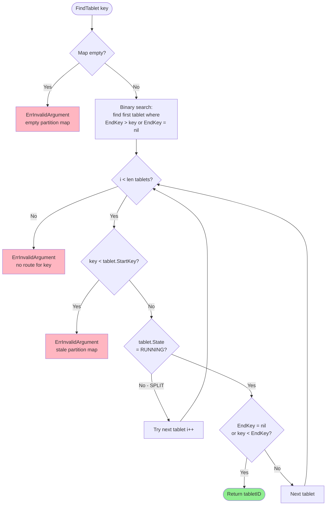
```mermaid
flowchart TD
    START([FindTablet key]) --> EMPTY{Map empty?}
    EMPTY -->|Yes| ERR1[ErrInvalidArgument\nempty partition map]
    EMPTY -->|No| BSEARCH[Binary search:\nfind first tablet where\nEndKey > key or EndKey = nil]

    BSEARCH --> FOUND{i < len tablets?}
    FOUND -->|No| ERR2[ErrInvalidArgument\nno route for key]
    FOUND -->|Yes| STARTCHK{key < tablet.StartKey?}
    STARTCHK -->|Yes| ERR3[ErrInvalidArgument\nstale partition map]
    STARTCHK -->|No| RUNNING{tablet.State\n= RUNNING?}
    RUNNING -->|No - SPLIT| NEXTTAB[Try next tablet i++]
    NEXTTAB --> FOUND
    RUNNING -->|Yes| ENDCHK{EndKey = nil\nor key < EndKey?}
    ENDCHK -->|Yes| MATCH([Return tabletID])
    ENDCHK -->|No| NEXTTAB2[Next tablet]
    NEXTTAB2 --> FOUND

    style MATCH fill:#90EE90
    style ERR1 fill:#FFB6C1
    style ERR2 fill:#FFB6C1
    style ERR3 fill:#FFB6C1
```

---

## 19. Flowchart: Tablet Split

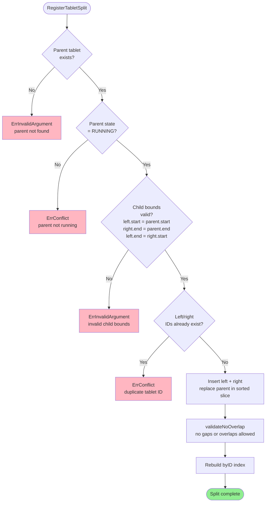
```mermaid
flowchart TD
    START([RegisterTabletSplit]) --> FIND{Parent tablet\nexists?}
    FIND -->|No| ERR1[ErrInvalidArgument\nparent not found]
    FIND -->|Yes| STCHK{Parent state\n= RUNNING?}
    STCHK -->|No| ERR2[ErrConflict\nparent not running]
    STCHK -->|Yes| RANGECHK{Child bounds\nvalid?\nleft.start = parent.start\nright.end = parent.end\nleft.end = right.start}
    RANGECHK -->|No| ERR3[ErrInvalidArgument\ninvalid child bounds]
    RANGECHK -->|Yes| DUPCHK{Left/right\nIDs already exist?}
    DUPCHK -->|Yes| ERR4[ErrConflict\nduplicate tablet ID]
    DUPCHK -->|No| INSERT[Insert left + right\nreplace parent in sorted slice]
    INSERT --> VALIDATE[validateNoOverlap\nno gaps or overlaps allowed]
    VALIDATE --> REBUILDIDX[Rebuild byID index]
    REBUILDIDX --> DONE([Split complete])

    style DONE fill:#90EE90
    style ERR1 fill:#FFB6C1
    style ERR2 fill:#FFB6C1
    style ERR3 fill:#FFB6C1
    style ERR4 fill:#FFB6C1
```

---

## 20. Sequence: RPC Request Dispatch

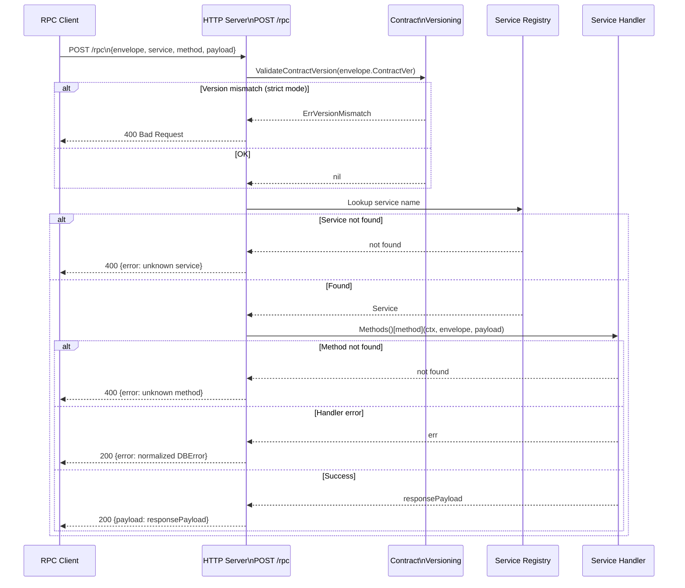
```mermaid
sequenceDiagram
    participant C as RPC Client
    participant SRV as HTTP Server\nPOST /rpc
    participant VER as Contract\nVersioning
    participant REG as Service Registry
    participant SVC as Service Handler

    C->>SRV: POST /rpc\n{envelope, service, method, payload}
    SRV->>VER: ValidateContractVersion(envelope.ContractVer)
    alt Version mismatch (strict mode)
        VER-->>SRV: ErrVersionMismatch
        SRV-->>C: 400 Bad Request
    else OK
        VER-->>SRV: nil
    end

    SRV->>REG: Lookup service name
    alt Service not found
        REG-->>SRV: not found
        SRV-->>C: 400 {error: unknown service}
    else Found
        REG-->>SRV: Service
        SRV->>SVC: Methods()[method](ctx, envelope, payload)
        alt Method not found
            SVC-->>SRV: not found
            SRV-->>C: 400 {error: unknown method}
        else Handler error
            SVC-->>SRV: err
            SRV-->>C: 200 {error: normalized DBError}
        else Success
            SVC-->>SRV: responsePayload
            SRV-->>C: 200 {payload: responsePayload}
        end
    end
```

---

## 21. ER: Core Data Model

```mermaid
erDiagram
    NAMESPACE ||--o{ TABLE : contains
    TABLE ||--|{ TABLET : "partitioned into"
    TABLET ||--|{ REPLICA : "replicated across"
    REPLICA }o--|| TSERVER : "hosted on"
    TABLE ||--o{ CDC_STREAM : "captured by"
    CDC_STREAM ||--|{ CDC_EVENT : "produces"
    CDC_STREAM ||--o{ STREAM_JOB : "driven by"
    CDC_STREAM ||--o{ CHECKPOINT : "tracks progress via"
    SNAPSHOT ||--|{ TABLET_SNAPSHOT : "covers"
    TABLET_SNAPSHOT }o--|| TABLET : "from"
    TXN ||--o{ INTENT : "writes"
    INTENT }o--|| TABLET : "on"

    NAMESPACE {
        string id PK
        string name
    }
    TABLE {
        string id PK
        string namespace_id FK
        string name
        string state
        uint64 version
        uint64 epoch
    }
    TABLET {
        string id PK
        string table_id FK
        bytes start_key
        bytes end_key
        string state
        int replica_count
        uint64 state_version
    }
    REPLICA {
        string tablet_id FK
        string tserver_id FK
        bool is_primary
    }
    TSERVER {
        string uuid PK
        string rpc_address
        string http_address
        time last_heartbeat
        uint64 report_seq_no
    }
    CDC_STREAM {
        string id PK
        string tablet_id FK
        string primary_owner
        uint64 ownership_epoch
        string state
    }
    CDC_EVENT {
        string stream_id FK
        string tablet_id FK
        uint64 sequence PK
        time timestamp_utc
        bytes payload
    }
    CHECKPOINT {
        string stream_id FK
        string tablet_id FK
        uint64 sequence
    }
    SNAPSHOT {
        string id PK
        uint64 create_ht
        string state
        time created_at
    }
    TABLET_SNAPSHOT {
        string snapshot_id FK
        string tablet_id FK
        string state
    }
    TXN {
        string id PK
        string state
        uint64 commit_ht
        uint64 priority
        uint64 start_ht
        string isolation
    }
    INTENT {
        string txn_id FK
        string tablet_id FK
        bytes key
    }
```

---

## 22. Class: Storage & WAL Layer

```mermaid
classDiagram
    class Store {
        <<interface>>
        +ApplyWriteBatch(ctx, kind DBKind, wb WriteBatch) error
        +Get(ctx, kind DBKind, key []byte) ([]byte, bool, error)
        +NewIterator(ctx, kind DBKind, prefix []byte) (Iterator, error)
    }
    class MemoryStore {
        -mu sync.RWMutex
        -data map[DBKind]map[string][]byte
        +ApplyWriteBatch(ctx, kind, wb) error
        +Get(ctx, kind, key) ([]byte, bool, error)
        +NewIterator(ctx, kind, prefix) (Iterator, error)
    }
    class DBKind {
        <<enumeration>>
        RegularDB
        IntentsDB
    }
    class WriteBatch {
        +Puts []KVPair
        +Deletes [][]byte
    }
    class Log {
        -cfg Config
        -entries []Entry
        -index map[OpID]indexPos
        -appendQ chan appendRequest
        -segmentNo int
        +AppendAsync(entries, cb) error
        +AppendSync(ctx, entries) error
        +ReadFrom(from OpID, max int) []Entry
        +LastOpID() OpID
        +Rotate() error
        +IndexLookup(op OpID) (segment, offset, ok)
        +Close() error
    }
    class Entry {
        +OpID OpID
        +HybridTime uint64
        +Payload []byte
    }
    class Config {
        +Dir string
        +SegmentFile string
        +MaxSegmentBytes int64
    }
    Store <|.. MemoryStore : implements
    MemoryStore --> DBKind
    MemoryStore --> WriteBatch
    Log --> Entry
    Log --> Config
```

---

## 23. Class: Transaction & Conflict Layer

```mermaid
classDiagram
    class TxnCoordinator {
        <<interface>>
        +Begin(ctx, reqID) (txnID, startHT, error)
        +Commit(ctx, txnID, reqID, commitHT) (uint64, error)
        +Abort(ctx, txnID, reqID) error
    }
    class TxnManager {
        -records map[TxnID]Record
        -mu sync.RWMutex
        +Begin(ctx, reqID) (txnID, startHT, error)
        +Commit(ctx, txnID, reqID, commitHT) (uint64, error)
        +Abort(ctx, txnID, reqID) error
        +ApplyIntents(ctx, txnID, commitHT, batchLimit) error
        +RemoveIntents(ctx, txnID) error
    }
    class Record {
        +TxnID TxnID
        +State State
        +CommitHT uint64
        +Priority uint64
        +StartHT uint64
        +Isolation IsolationLevel
        +InvolvedTablets map[TabletID]struct
    }
    class Resolver {
        -scanner IntentScanner
        -statusSrc StatusSource
        -abortFn AbortFn
        -cfg Config
        +Check(ctx, keys, myTxnID, myPriority, snapshotHT) error
    }
    class WaitQueue {
        -graph map[TxnID]map[TxnID]struct
        -notif map[TxnID]chan struct
        +Enqueue(waiter, blocker) chan
        +Release(txnID)
        +DetectCycles() cycles
        +Graph() snapshot
        +Depth() int
    }
    class IntentScanner {
        <<interface>>
        +ScanIntents(ctx, keys) ([]Intent, error)
    }
    class StatusSource {
        <<interface>>
        +GetStatus(ctx, txnID) (StatusResult, error)
    }
    TxnCoordinator <|.. TxnManager : implements
    TxnManager --> Record
    Resolver --> IntentScanner
    Resolver --> StatusSource
    Resolver --> WaitQueue
```

---

## 24. Sequence: CDC Store Operations

```mermaid
sequenceDiagram
    participant WRITER as Tablet / Writer
    participant CDCS as CDC Store
    participant SCHED as CP Scheduler
    participant XCLU as xCluster Loop

    Note over CDCS: events[streamID][tabletID][]Event\ncheckpoints[streamID][tabletID]Checkpoint

    WRITER->>CDCS: AppendEvent({streamID, tabletID, seq, payload})
    Note over CDCS: Reject if seq <= last (noop if equal,\nerror if less — monotonic guarantee)
    CDCS-->>WRITER: ok

    SCHED->>CDCS: GetCheckpoint(streamID, tabletID)
    CDCS-->>SCHED: Checkpoint{seq=N}

    SCHED->>CDCS: Poll({streamID, tabletID, afterSeq=N, maxRecords=64})
    Note over CDCS: Return events where seq > N, up to maxRecords
    CDCS-->>SCHED: PollResponse{events, latestSeen}

    SCHED->>XCLU: ApplyBatch(events)
    XCLU-->>SCHED: ok

    SCHED->>CDCS: AdvanceCheckpoint({streamID, tabletID, seq=latestSeen})
    Note over CDCS: Reject if seq < current (no regression)
    CDCS-->>SCHED: ok

    Note over CDCS: LagEvents = latestSeen - checkpoint
```

---

## 25. State: Remote Bootstrap Session

```mermaid
stateDiagram-v2
    [*] --> INIT : StartRemoteBootstrap\n(check session cap ≤ 4)
    INIT --> TRANSFERRING : Session registered\nManifest available
    TRANSFERRING --> FINALIZED : FinalizeBootstrap()\nor FinalizeWithValidation()
    TRANSFERRING --> ABORTED : AbortSession()
    TRANSFERRING --> FAILED : SessionTimeout\n(idle > 10 min)
    FINALIZED --> [*]
    ABORTED --> [*]
    FAILED --> [*]
```

---

## 26. State: ControlPlane Stream & Job

**Stream States** (OwnershipEpoch bumps on primary failover — Scheduler resets batch to 1 for safe checkpoint advance)

```mermaid
stateDiagram-v2
    [*] --> RUNNING : CreateStream
    RUNNING --> PAUSED : Pause
    PAUSED --> RUNNING : Resume
    RUNNING --> STOPPED : Stop
    PAUSED --> STOPPED : Stop
    STOPPED --> [*]
```

**Job States** (each Job is linked to a Stream)

```mermaid
stateDiagram-v2
    [*] --> RUNNING : CreateJob
    RUNNING --> PAUSED : Pause
    PAUSED --> RUNNING : Resume
    RUNNING --> STOPPED : Stop
    PAUSED --> STOPPED : Stop
    STOPPED --> [*]
```

---

## 27. Flowchart: Test Cluster Bootstrap

```mermaid
flowchart TD
    START([StartTestCluster spec]) --> DEFAULTS[Apply defaults:\nMemoryLimit=512MiB\nReplicationFactor=1]
    DEFAULTS --> MASTERLOOP[For each master node]

    subgraph startnode[startNode - repeated per node]
        TMPDIR[os.MkdirTemp\nephemeral data dir]
        --> FSM[FSManager.Init]
        --> RPC[rpc.NewServer\nbind 127.0.0.1:0]
        --> RT[server.NewRuntime\ncfg + MemoryStore]
        --> START_RT[Runtime.Start\nRPC + SQL + CQL]
        --> HANDLE[NodeHandle\nNodeID, RPCAddress, runtime]
    end

    MASTERLOOP --> startnode
    startnode --> TSLOOP[For each tserver node]
    TSLOOP --> startnode2[startNode - same steps]
    startnode2 --> CLUSTER([ClusterHandle\nmasters and tservers])

    CLUSTER --> TEARDOWN{{Teardown\nstops all runtimes\nremoves temp dirs}}

    style CLUSTER fill:#90EE90
    style TEARDOWN fill:#FFD700
```

---

## 28. Flowchart: Runtime Graceful Shutdown

```mermaid
flowchart TD
    SIGNAL([SIGINT / SIGTERM]) --> STOP[runtime.Stop]
    STOP --> Q_STOP[Stop Query Layer\nSQL Coordinator + CQL Server]
    Q_STOP --> RPC_SHUT[RPC Server.Shutdown\nwait for in-flight requests]
    RPC_SHUT --> WAL_FLUSH[Flush WAL segments\nfsync + close]
    WAL_FLUSH --> CLEANUP[Release FSManager\nTemp dirs cleaned on test teardown]
    CLEANUP --> DONE([Stopped])

    style DONE fill:#90EE90
```

---

## 29. Sequence: Master Node Startup

```mermaid
sequenceDiagram
    participant MAIN as main()
    participant RPC as RPC Server
    participant CAT as Catalog Manager
    participant HB as Heartbeat Service
    participant SNAP as Snapshot Service
    participant RT as Runtime

    MAIN->>RPC: NewServer(bindAddress)
    MAIN->>RPC: RegisterService(ping)
    MAIN->>CAT: NewManager(syscatalog, rocks)
    MAIN->>HB: NewService(tsManager) + NewTSManager()
    MAIN->>SNAP: NewCoordinator(store, tabletRPCRegistry)
    MAIN->>RT: NewRuntime(cfg, rpcSrv, rocksStore)
    RT->>RT: Set catalog as Primary
    RT->>RT: Set heartbeat as Primary
    MAIN->>RPC: RegisterService(heartbeat)
    MAIN->>RPC: RegisterService(snapshot)
    MAIN->>RT: Init() — no-op for master
    MAIN->>RT: Start()
    RT->>RPC: Start() — listen TCP
    RT->>RT: Start SQL Coordinator (if enabled)
    RT->>RT: Start CQL Server (if enabled)
    MAIN->>MAIN: Wait for SIGINT/SIGTERM
    MAIN->>RT: Stop() — graceful shutdown
```

---

## 30. Flowchart: CDC Lag Monitoring

```mermaid
flowchart LR
    WRITER([Tablet Writer]) -->|AppendEvent\nseq=N| CDCSTORE[(CDC Store\nevents)]
    CDCSTORE -->|latestSeq=N| LAG_CALC{LagSnapshot\nlatestSeq - checkpoint}
    SCHED([Scheduler]) -->|AdvanceCheckpoint\nseq=M| CPSTORE[(Checkpoint Store)]
    CPSTORE -->|checkpoint=M| LAG_CALC
    LAG_CALC -->|lagEvents = N-M| OBS([Observability\nMetrics])
    OBS -->|Emit metrics| DASH([Dashboard / Alerts])

    style DASH fill:#90EE90
```
